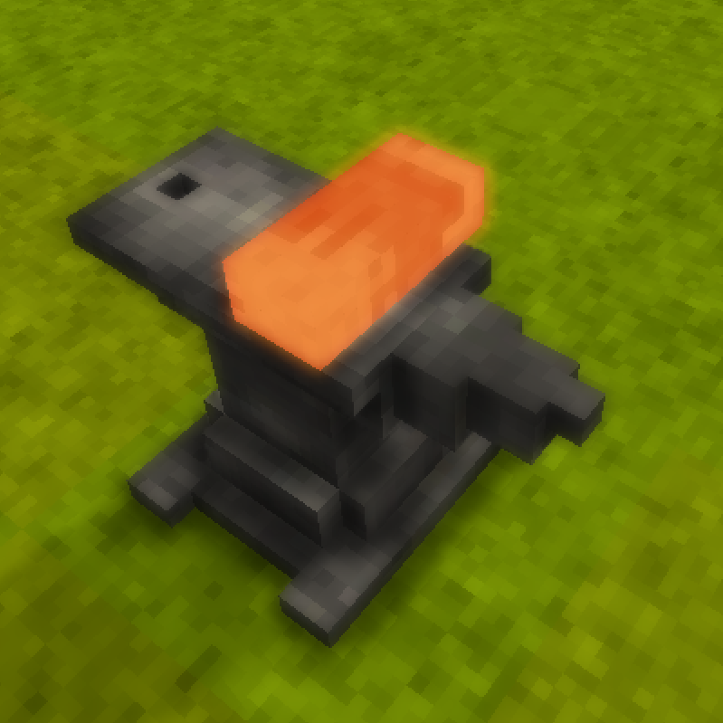
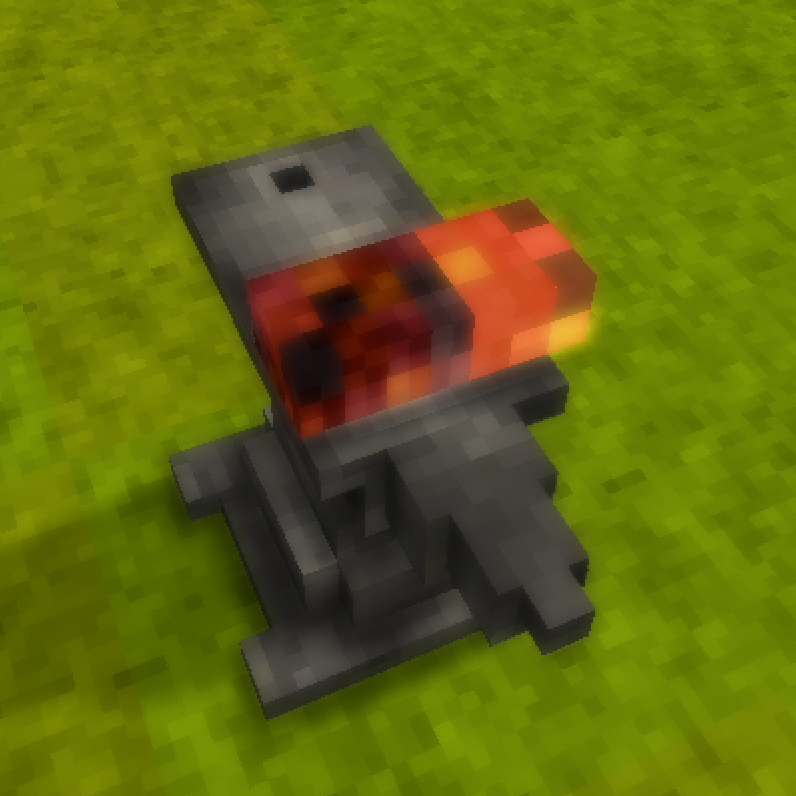

# ThermoTesting (Vintage Story Mod)

A rendering and simulation experiment that upgrades the vanilla Vintage Story blacksmithing rendering system to support per-voxel materials and temperatures for ingots and smithing items.

## Overview 

This project replaces the default ingot and smithing item system (one material and temperature per item) with a voxel-level data model, enabling per-voxel materials and temperatures. 
The current version adds support for per-voxel material and temperature rendering. The long-term goal of this mod is to support full material-based thermal simulations.

To support this, multiple parts of the base game are modified through patching:
 - Serialization/Deserialization protocols
 - Mesh generation
 - Rendering

## Demo

| Before (Vanilla) | After (Modded) |
|--------|-------|
| |  |
|(Uniformly heated copper ingot) | (Half-blackbronze/half-copper ingot with random per-voxel heating)|
|Single material and temperature ingot | Per-voxel material and temperature support |

## How It Works
The system introduces an external voxel data system integrated into the game via runtime patches.
Patching is done through Harmony. Reflection is used to access private fields in several instances.

### Components:
 - External data system for storing per-voxel temperature data for each workitem
 - Engine patches that access the external temperature data

### Core Pipeline:
1. Generate both volumetric and flattened per-voxel temperature data and store it within an external dictionary
2. Generate per-voxel material mesh (ItemWorkItem.GenMesh patch)
3. Assign temperature data indices to mesh vertices (ItemWorkItem.GenMesh patch)
4. Upload the mesh and flattened temperature data to the GPU (AnvilWorkItemRenderer.OnRenderFrame patch)
5. Sample temperature data in a custom shader

This allows per-voxel materials and temperatures to be rendered.

## Build Structure

This project is intended to be built within a specific project structure:

```
VintageStoryInstances/
└── VintageStory_[VERSION]/
    ├── VintageStory/         (install folder)
    ├── VintageStoryData/     (install data folder)
    └── Projects/
        ├── Directory.Build.props
        └── ThermoTesting/    (mod project folder)
```
The build scripts and dependencies are relative and this structure ensures that everything is found properly.
`Directory.Build.props` is included in the repository and should be placed in the `Projects/` directory as shown above.

## Status
**Active Development**

This project is an ongoing exploration of voxel-based thermal simulations. I plan on expanding it to support material-based thermal simulations, and investigating GPU-based thermal simulations in the future.
